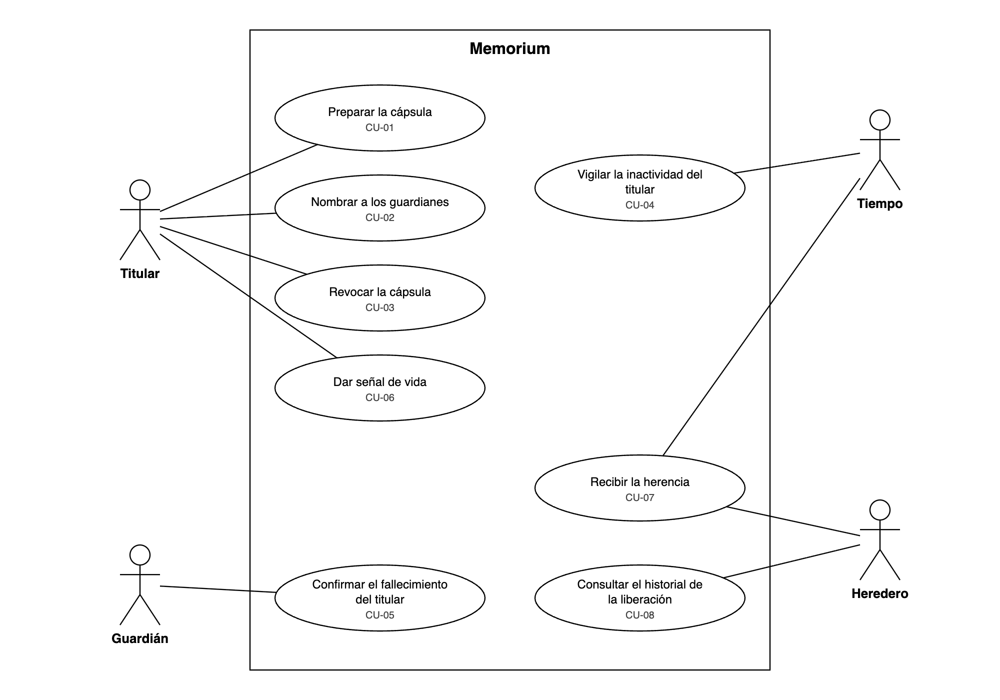

# Especificación de requisitos

- **Sistema:** Memorium
- **Autor:** Emiliano Cabañas Prieto
- **Versión:** 1.0
- **Fecha de la última actualización:** 30-09-2026

---

## 1. Propósito y alcance

**Propósito del documento:**

Este documento describe qué debe hacer Memorium y cómo debe comportarse, con el detalle suficiente para que alguien pueda diseñarlo y construirlo sin adivinar. Está dirigido a quien diseñe el sistema en la Unidad 3, a quien lo pruebe, y a mi dupla como revisora. Cada requisito indica de dónde salió, para distinguir lo que confirmó una persona real de lo que sigo suponiendo.

**Alcance del sistema:**

Retomado de la [Visión del producto](vision-del-producto.md). Memorium permite que una persona (el titular) prepare una cápsula cifrada con llaves de acceso a su dinero digital, mensajes, fotos y documentos, y que esa cápsula se entregue a sus herederos solo cuando se cumplen dos condiciones a la vez: que el titular deje de dar señal de vida durante el plazo que configuró y que un número mínimo de sus guardianes confirme el fallecimiento. Antes de liberar, el sistema abre un periodo de gracia en el que el titular puede cancelar todo.

Dentro del alcance: crear y editar la cápsula, asignar elementos a herederos, nombrar guardianes y el mínimo de confirmaciones, registrar señales de vida, detectar la inactividad, abrir el periodo de gracia, contar confirmaciones, liberar el acceso, cancelar el proceso y revocar la cápsula.

**Fuera del alcance:**

- Guardar o mover los fondos del titular. Memorium entrega llaves, no dinero.
- Recuperar el acceso si el titular pierde su propia llave maestra.
- Sustituir un testamento o validar la herencia ante la ley.
- Consultar el registro civil para verificar un acta de defunción oficial.
- Soportar otras redes distintas de Solana en la primera versión.
- Dar asesoría legal o fiscal sobre los activos heredados.

---

## 2. Usuarios y su contexto

| Usuario | Qué hace hoy sin el sistema | Qué espera del sistema |
|---|---|---|
| Titular | Guarda su frase de recuperación en un papel, una caja fuerte o su memoria. A veces se la dice a un familiar, la deja en un sobre o la mete en un testamento. Muchas veces no hace nada. | Dejar preparada su herencia digital sin darle el control de su dinero a nadie mientras viva, y poder cambiarla cuando quiera. |
| Heredero | Si nadie le dejó la frase, pierde el acceso para siempre. Si se la dejaron, muchas veces no sabe qué hacer con ella. | Enterarse de que hay algo para él y poder usarlo sin trámites imposibles ni conocimientos técnicos. |
| Guardián | Hoy no existe como rol: es el familiar o amigo al que le toca "saber dónde está el papel". | Entender qué se espera de él, confirmar de forma sencilla y no cargar con la culpa si algo sale mal. |

> **Pendiente de la entrevista:** esta tabla se corrige con lo que salga de la entrevista con mi dupla. Los cambios se anotan en el registro de cambios (sección 7).

**Conflictos identificados entre usuarios:**

1. **Titular contra heredero: seguridad contra certeza.** El titular quiere que la cápsula sea imposible de abrir mientras viva. El heredero quiere la certeza de que se abrirá cuando muera. Cada mecanismo que da certeza al heredero es una forma de abrir antes de tiempo. **Decisión tomada:** se exigen dos condiciones a la vez más un periodo de gracia (RF-010, RF-012, RNF-SEG-003). Priorizo al titular, porque una cápsula abierta antes de tiempo no se puede volver a cerrar, mientras que una cápsula que tarda en abrirse todavía se puede abrir.
2. **Guardián contra heredero: velocidad contra cautela.** Si el guardián confirma rápido, puede liberar la herencia de alguien vivo. Si duda, la familia espera. **Decisión tomada:** el guardián puede posponer su respuesta sin consecuencias (flujo alterno 3a de CU-05), y ninguna confirmación individual libera nada por sí sola (RF-004).
3. **Guardián contra heredero: transparencia contra protección.** El heredero necesita saber cómo se liberó la cápsula para poder disputarla (RF-019). El guardián teme que lo culpen o lo presionen si se sabe que confirmó. **Pendiente:** no he decidido si el historial muestra el nombre de cada guardián o solo el conteo. Lo pregunto en la entrevista (S-10).

---

## 3. Requisitos funcionales

### 3.1 Resumen

| ID | Nombre | Prioridad | Origen |
|---|---|---|---|
| RF-001 | Registrar una cápsula | Imprescindible | Supuesto propio |
| RF-002 | Asignar elementos a cada heredero | Imprescindible | Supuesto propio |
| RF-003 | Registrar a los guardianes | Imprescindible | Supuesto propio |
| RF-004 | Definir el mínimo de confirmaciones | Imprescindible | Supuesto propio |
| RF-005 | Separar guardianes de herederos | Imprescindible | Supuesto propio |
| RF-006 | Configurar el plazo de inactividad | Imprescindible | Supuesto propio |
| RF-007 | Reiniciar el contador de inactividad | Imprescindible | Supuesto propio |
| RF-008 | Solicitar confirmación a los guardianes | Imprescindible | Supuesto propio |
| RF-009 | Registrar la confirmación de un guardián | Imprescindible | Supuesto propio |
| RF-010 | Abrir el periodo de gracia | Imprescindible | Supuesto propio |
| RF-011 | Notificar al titular durante el periodo de gracia | Imprescindible | Supuesto propio |
| RF-012 | Cancelar la liberación | Imprescindible | Supuesto propio |
| RF-013 | Liberar los elementos a los herederos | Imprescindible | Supuesto propio |
| RF-014 | Notificar a los herederos | Importante | Supuesto propio |
| RF-015 | Poner la cápsula en alerta | Importante | Supuesto propio |
| RF-016 | Editar la cápsula | Importante | Supuesto propio |
| RF-017 | Revocar la cápsula | Importante | Supuesto propio |
| RF-018 | Registrar los eventos de la liberación | Imprescindible | Supuesto propio |
| RF-019 | Mostrar el historial al heredero | Importante | Supuesto propio |
| RF-020 | Recordar al titular antes del vencimiento | Importante | Supuesto propio |
| RF-021 | Avisar a los guardianes de una cancelación | Deseable | Supuesto propio |
| RF-022 | Verificar la identidad del guardián | Imprescindible | Supuesto propio |
| RF-023 | Bloquear confirmaciones tras intentos fallidos | Importante | Supuesto propio |

> **Nota sobre el Origen:** todos dicen "Supuesto propio" porque salieron de mi Visión del producto, que escribí yo sin hablar con nadie. Los que tienen un código S-xx en su ficha se verifican en la entrevista (ver [guion](guion-entrevista.md)). Después de la entrevista, los confirmados cambian a "Entrevista con [dupla], [fecha]".

### 3.2 Fichas

#### RF-001 · Registrar una cápsula

| Campo | Contenido |
|---|---|
| Descripción | El sistema registra una cápsula a nombre del titular con al menos un elemento de cualquiera de estos tipos: llave de acceso, mensaje, foto o documento. |
| Origen | Supuesto propio (Visión del producto, alcance). Se verifica con S-06. |
| Prioridad | Imprescindible |
| Criterio de aceptación | Al guardar una cápsula con un elemento de cualquiera de los cuatro tipos, la cápsula aparece en la lista del titular con el número correcto de elementos. Si el titular intenta guardarla sin elementos, el sistema no la guarda e indica que falta al menos uno. |
| Relacionado con | RF-002, RF-016, RNF-SEG-001 |

#### RF-002 · Asignar elementos a cada heredero

| Campo | Contenido |
|---|---|
| Descripción | El sistema asigna a cada heredero únicamente los elementos de la cápsula que el titular eligió para él. |
| Origen | Supuesto propio (Visión del producto, alcance). Se verifica con S-07. |
| Prioridad | Imprescindible |
| Criterio de aceptación | Con una cápsula de tres elementos y dos herederos, donde A recibe los elementos 1 y 2 y B recibe el 3, la vista de asignación muestra exactamente esa distribución. El sistema no guarda la cápsula si algún elemento queda sin heredero. |
| Relacionado con | RF-001, RF-013 |

#### RF-003 · Registrar a los guardianes

| Campo | Contenido |
|---|---|
| Descripción | El sistema registra al menos dos guardianes por cápsula, cada uno con al menos un medio de contacto. |
| Origen | Supuesto propio (Visión del producto, regla de negocio 1). Se verifica con S-02. |
| Prioridad | Imprescindible |
| Criterio de aceptación | Con un solo guardián registrado, el sistema no activa la cápsula e indica que faltan guardianes. Con dos guardianes, cada uno con un correo o teléfono, la cápsula se activa. Un guardián sin medio de contacto no se guarda. |
| Relacionado con | RF-004, RF-005, RF-008 |

#### RF-004 · Definir el mínimo de confirmaciones

| Campo | Contenido |
|---|---|
| Descripción | El sistema registra el número mínimo de confirmaciones (N) que exige la cápsula, con N mayor o igual a 2 y menor o igual al total de guardianes (M). |
| Origen | Supuesto propio (Visión del producto, regla de negocio 1). |
| Prioridad | Imprescindible |
| Criterio de aceptación | Con tres guardianes: N = 1 se rechaza, N = 2 y N = 3 se aceptan, N = 4 se rechaza. En cada rechazo el sistema muestra el rango válido. |
| Relacionado con | RF-003, RF-010, RF-015, RNF-SEG-002 |

#### RF-005 · Separar guardianes de herederos

| Campo | Contenido |
|---|---|
| Descripción | El sistema impide registrar como guardián a una persona que es heredera de la misma cápsula. |
| Origen | Supuesto propio (Visión del producto, regla de negocio 3). Se verifica con S-03. |
| Prioridad | Imprescindible |
| Criterio de aceptación | Si el correo o el teléfono de un guardián coincide con el de un heredero de la misma cápsula, el sistema no lo guarda y explica el motivo. Aplica en los dos sentidos: tampoco se puede registrar como heredero a un guardián. |
| Relacionado con | RF-003, RF-009 |

#### RF-006 · Configurar el plazo de inactividad

| Campo | Contenido |
|---|---|
| Descripción | El sistema registra el plazo de inactividad que elige el titular, entre 30 y 365 días. |
| Origen | Supuesto propio (el rango lo propuse yo). Se verifica con S-01 y S-04. |
| Prioridad | Imprescindible |
| Criterio de aceptación | 29 días se rechaza, 30 y 365 días se aceptan, 366 días se rechaza. El sistema no activa una cápsula sin plazo configurado. |
| Relacionado con | RF-007, RF-008, RF-020 |

#### RF-007 · Reiniciar el contador de inactividad

| Campo | Contenido |
|---|---|
| Descripción | El sistema reinicia el contador de inactividad cada vez que el titular da una señal de vida: inicia sesión, edita la cápsula o responde a una notificación de Memorium. |
| Origen | Supuesto propio (Visión del producto, regla de negocio 4). Se verifica con S-01. |
| Prioridad | Imprescindible |
| Criterio de aceptación | Con el contador en el día 45 de un plazo de 90, cualquiera de las tres acciones regresa el contador a 0 y la cápsula muestra "Última señal de vida: hoy". Consultar la página pública de Memorium sin iniciar sesión no reinicia el contador. |
| Relacionado con | RF-006, RF-012, RF-016 |

#### RF-008 · Solicitar confirmación a los guardianes

| Campo | Contenido |
|---|---|
| Descripción | El sistema envía una solicitud de confirmación a cada guardián cuando vence el plazo de inactividad del titular. |
| Origen | Supuesto propio (Visión del producto, descripción del sistema). |
| Prioridad | Imprescindible |
| Criterio de aceptación | En el día 90 de un plazo de 90, cada guardián recibe la solicitud en sus medios registrados. En el día 89 ningún guardián la ha recibido. |
| Relacionado con | RF-003, RF-009, RF-020 |

#### RF-009 · Registrar la confirmación de un guardián

| Campo | Contenido |
|---|---|
| Descripción | El sistema registra la confirmación de fallecimiento de cada guardián con fecha y hora. |
| Origen | Supuesto propio (Visión del producto, regla de negocio 1). |
| Prioridad | Imprescindible |
| Criterio de aceptación | Al confirmar, el conteo de la cápsula pasa de k a k + 1 de N y el evento aparece en el historial con fecha y hora. Si el mismo guardián confirma dos veces, el conteo aumenta una sola vez. |
| Relacionado con | RF-010, RF-018, RF-022 |

#### RF-010 · Abrir el periodo de gracia

| Campo | Contenido |
|---|---|
| Descripción | El sistema abre un periodo de gracia de 14 días cuando el plazo de inactividad ya venció y las confirmaciones alcanzan el mínimo N. |
| Origen | Supuesto propio (Visión del producto, regla de negocio 2; la duración de 14 días la propuse yo). Se verifica con S-05. |
| Prioridad | Imprescindible |
| Criterio de aceptación | Con el plazo vencido y N menos 1 confirmaciones, el estado sigue en "Esperando confirmaciones". Con la confirmación número N, el estado cambia a "Periodo de gracia" y la fecha de cierre es la fecha de apertura más 14 días. |
| Relacionado con | RF-009, RF-011, RF-012, RF-013, RNF-SEG-003 |

#### RF-011 · Notificar al titular durante el periodo de gracia

| Campo | Contenido |
|---|---|
| Descripción | El sistema notifica al titular por cada medio de contacto registrado cada 72 horas mientras el periodo de gracia está abierto, empezando en el momento en que se abre. |
| Origen | Supuesto propio (Visión del producto, regla de negocio 2). Se verifica con S-05. |
| Prioridad | Imprescindible |
| Criterio de aceptación | Con un titular que registró correo y teléfono, al abrir el periodo de gracia se envía un aviso a cada medio, y se repite a las 72, 144, 216 y 288 horas. Si el titular da señal de vida, los avisos pendientes ya no se envían. |
| Relacionado con | RF-010, RF-012, RNF-REN-001 |

#### RF-012 · Cancelar la liberación

| Campo | Contenido |
|---|---|
| Descripción | El sistema cancela el proceso de liberación cuando el titular da una señal de vida durante el periodo de gracia. |
| Origen | Supuesto propio (Visión del producto, regla de negocio 2). |
| Prioridad | Imprescindible |
| Criterio de aceptación | En el día 5 de 14 del periodo de gracia, el titular inicia sesión: el estado vuelve a "Activa", las confirmaciones regresan a 0 y el contador de inactividad regresa a 0. Ningún heredero recibe acceso. |
| Relacionado con | RF-007, RF-010, RF-021, RNF-SEG-003 |

#### RF-013 · Liberar los elementos a los herederos

| Campo | Contenido |
|---|---|
| Descripción | El sistema entrega a cada heredero el acceso a los elementos que le fueron asignados cuando el periodo de gracia vence sin señal de vida del titular. |
| Origen | Supuesto propio (Visión del producto, alcance). |
| Prioridad | Imprescindible |
| Criterio de aceptación | Al cerrar el día 14 sin señal de vida, el heredero A ve los elementos 1 y 2 y no ve el 3; el heredero B ve solo el 3. Antes de ese momento, ningún heredero ve ningún elemento. |
| Relacionado con | RF-002, RF-010, RF-014, RNF-SEG-001, RNF-SEG-003 |

#### RF-014 · Notificar a los herederos

| Campo | Contenido |
|---|---|
| Descripción | El sistema notifica a cada heredero que tiene elementos disponibles en el momento en que se liberan. |
| Origen | Supuesto propio. Se verifica con S-08. |
| Prioridad | Importante |
| Criterio de aceptación | Al liberarse la cápsula, cada heredero con al menos un elemento asignado recibe un aviso en sus medios registrados en menos de 15 minutos. Un heredero sin elementos no recibe aviso. |
| Relacionado con | RF-013 |

#### RF-015 · Poner la cápsula en alerta

| Campo | Contenido |
|---|---|
| Descripción | El sistema impide la liberación de una cápsula mientras el número de guardianes disponibles sea menor que el mínimo N. Un guardián deja de estar disponible cuando renuncia al rol o cuando todos sus medios de contacto fallan. |
| Origen | Supuesto propio (Visión del producto, regla de negocio 5). |
| Prioridad | Importante |
| Criterio de aceptación | Con N = 2 y tres guardianes, cuando dos dejan de estar disponibles, el estado cambia a "En alerta" y el titular recibe un aviso para nombrar reemplazos. En ese estado no se abre el periodo de gracia aunque venza el plazo. |
| Relacionado con | RF-003, RF-004, RNF-SEG-003 |

#### RF-016 · Editar la cápsula

| Campo | Contenido |
|---|---|
| Descripción | El sistema registra los cambios que el titular hace a los elementos, herederos y guardianes de una cápsula que no ha sido liberada. |
| Origen | Supuesto propio (Visión del producto, alcance). |
| Prioridad | Importante |
| Criterio de aceptación | Después de cambiar un heredero, la vista de asignación muestra la nueva distribución. En una cápsula ya liberada, el sistema rechaza cualquier edición. |
| Relacionado con | RF-001, RF-007, RNF-SEG-005 |

#### RF-017 · Revocar la cápsula

| Campo | Contenido |
|---|---|
| Descripción | El sistema revoca de forma definitiva la cápsula que el titular decide revocar. |
| Origen | Supuesto propio (Visión del producto, alcance). |
| Prioridad | Importante |
| Criterio de aceptación | Después de revocar, el estado es "Revocada", no se envían solicitudes a los guardianes aunque venza el plazo y ningún heredero puede acceder a ningún elemento. |
| Relacionado con | RF-016, RNF-SEG-005 |

#### RF-018 · Registrar los eventos de la liberación

| Campo | Contenido |
|---|---|
| Descripción | El sistema registra con fecha y hora cada evento del proceso de liberación: vencimiento del plazo, solicitud a los guardianes, confirmación, apertura del periodo de gracia, aviso al titular, cancelación y liberación. |
| Origen | Supuesto propio (Visión del producto, atributo de auditabilidad). |
| Prioridad | Imprescindible |
| Criterio de aceptación | Después de recorrer un proceso completo de prueba, el historial contiene los siete tipos de evento en orden cronológico, cada uno con fecha, hora y quién lo originó. |
| Relacionado con | RF-019, RNF-SEG-004 |

#### RF-019 · Mostrar el historial al heredero

| Campo | Contenido |
|---|---|
| Descripción | El sistema muestra a cada heredero, después de la liberación, el historial de eventos que la produjo. |
| Origen | Supuesto propio (Visión del producto, atributo de auditabilidad). Conflicto pendiente, se verifica con S-10. |
| Prioridad | Importante |
| Criterio de aceptación | Un heredero de una cápsula liberada ve la lista cronológica de los eventos de RF-018 de esa cápsula. No ve eventos de otras cápsulas. Antes de la liberación, el historial no está disponible para él. |
| Relacionado con | RF-018, RNF-SEG-004. En conflicto con la preocupación del guardián (sección 2, conflicto 3). |

#### RF-020 · Recordar al titular antes del vencimiento

| Campo | Contenido |
|---|---|
| Descripción | El sistema envía un recordatorio al titular 7 días antes de que venza su plazo de inactividad. |
| Origen | Supuesto propio (lo agregué para reducir falsas alarmas por viajes o descuidos). Se verifica con S-01. |
| Prioridad | Importante |
| Criterio de aceptación | Con un plazo de 90 días y la última señal de vida en el día 0, el titular recibe el recordatorio en el día 83. Si da señal de vida antes del día 83, no lo recibe. |
| Relacionado con | RF-006, RF-007, RF-008 |

#### RF-021 · Avisar a los guardianes de una cancelación

| Campo | Contenido |
|---|---|
| Descripción | El sistema notifica a cada guardián que el proceso de liberación se canceló cuando el titular da señal de vida después de que se enviaron las solicitudes de confirmación. |
| Origen | Supuesto propio. |
| Prioridad | Deseable |
| Criterio de aceptación | Después de una cancelación, cada guardián que recibió la solicitud recibe el aviso de cancelación, y si abre la solicitud ve que ya no puede confirmar. |
| Relacionado con | RF-012 |

#### RF-022 · Verificar la identidad del guardián

| Campo | Contenido |
|---|---|
| Descripción | El sistema verifica que quien confirma es el guardián registrado, comprobando que controla el medio de contacto que el titular registró para él. |
| Origen | Supuesto propio. |
| Prioridad | Imprescindible |
| Criterio de aceptación | Una confirmación enviada sin completar la verificación no aumenta el conteo. Una persona que abre el enlace de la solicitud desde otro dispositivo no puede confirmar sin completar la verificación. |
| Relacionado con | RF-009, RF-023, RNF-SEG-002 |

#### RF-023 · Bloquear confirmaciones tras intentos fallidos

| Campo | Contenido |
|---|---|
| Descripción | El sistema bloquea por 24 horas la confirmación de un guardián después de tres intentos fallidos de verificación. |
| Origen | Supuesto propio. |
| Prioridad | Importante |
| Criterio de aceptación | Al tercer intento fallido, la pantalla informa el bloqueo y la hora en que termina. Durante esas 24 horas ningún intento de ese guardián se acepta, aunque sea correcto. |
| Relacionado con | RF-022 |

---

## 4. Requisitos no funcionales

Memorium es un sistema **SaaS con exigencias de sistema crítico** (Visión del producto, apartado 4). La Visión identificó cuatro atributos: seguridad, confidencialidad, auditabilidad y disponibilidad a largo plazo. En la nomenclatura del curso, confidencialidad y auditabilidad quedan dentro de **Seguridad** (así las agrupa también la norma ISO/IEC 25010), y la disponibilidad queda dentro de **Confiabilidad**. Por ser SaaS se agregan **Rendimiento**, **Escalabilidad** y **Usabilidad**.

**Atributo que no se incluye:** Mantenibilidad. No lo descarto como importante, pero hoy no tengo con qué ponerle una métrica honesta: depende de decisiones de diseño de la Unidad 3. Queda anotado para esa unidad.

### 4.1 Resumen

| ID | Atributo | Nombre | Prioridad | Origen |
|---|---|---|---|---|
| RNF-SEG-001 | Seguridad | Contenido ilegible antes de la liberación | Imprescindible | Derivado del tipo de sistema |
| RNF-SEG-002 | Seguridad | Nadie abre una cápsula por sí solo | Imprescindible | Derivado del tipo de sistema |
| RNF-SEG-003 | Seguridad | Cero liberaciones indebidas | Imprescindible | Derivado del tipo de sistema |
| RNF-SEG-004 | Seguridad | Historial inalterable | Imprescindible | Derivado del tipo de sistema |
| RNF-SEG-005 | Seguridad | Doble comprobación para cambios críticos | Importante | Supuesto propio |
| RNF-CON-001 | Confiabilidad | Disponibilidad mensual del servicio | Imprescindible | Derivado del tipo de sistema |
| RNF-CON-002 | Confiabilidad | Acceso aunque el operador desaparezca | Imprescindible | Derivado del tipo de sistema |
| RNF-REN-001 | Rendimiento | Envío oportuno de avisos de gracia | Imprescindible | Derivado del tipo de sistema |
| RNF-REN-002 | Rendimiento | Tiempo de despliegue de la solicitud | Importante | Derivado del tipo de sistema |
| RNF-ESC-001 | Escalabilidad | Capacidad con muchos titulares | Importante | Derivado del tipo de sistema |
| RNF-USA-001 | Usabilidad | Guardián confirma sin ayuda | Imprescindible | Supuesto propio |
| RNF-USA-002 | Usabilidad | Heredero accede sin ayuda | Imprescindible | Supuesto propio |

### 4.2 Fichas

#### RNF-SEG-001 · Contenido ilegible antes de la liberación

| Campo | Contenido |
|---|---|
| Atributo de calidad | Seguridad (confidencialidad) |
| Descripción | El contenido de una cápsula no puede ser leído por nadie antes de su liberación, incluido el personal que opera Memorium. |
| Métrica | En una inspección del almacenamiento con 20 cápsulas de prueba, 0 elementos se pueden leer sin pasar por la liberación. |
| Origen | Derivado del tipo de sistema: crítico, guarda llaves privadas (Visión, atributo de confidencialidad). |
| Prioridad | Imprescindible |
| Por qué importa | Una llave privada leída una sola vez basta para vaciar una cuenta, y eso no se revierte. Por eso el límite es cero y no un porcentaje. |
| Afecta a | RF-001, RF-013 |

#### RNF-SEG-002 · Nadie abre una cápsula por sí solo

| Campo | Contenido |
|---|---|
| Atributo de calidad | Seguridad |
| Descripción | Ninguna persona o entidad por sí sola, incluido el operador de Memorium, puede abrir una cápsula. |
| Métrica | En pruebas con las credenciales de cada actor por separado (operador, cada guardián, cada heredero), 0 aperturas exitosas. |
| Origen | Derivado del tipo de sistema (Visión, regla de negocio 6 y decisión de no custodia). |
| Prioridad | Imprescindible |
| Por qué importa | Si el operador pudiera abrir cualquier cápsula, Memorium sería el único lugar que un atacante necesita comprometer para robarle a todos. Es exactamente el riesgo que el proyecto existe para evitar. |
| Afecta a | RF-004, RF-013, RF-022 |

#### RNF-SEG-003 · Cero liberaciones indebidas

| Campo | Contenido |
|---|---|
| Atributo de calidad | Seguridad |
| Descripción | Ninguna cápsula se libera sin que el plazo de inactividad haya vencido, las confirmaciones hayan alcanzado el mínimo y el periodo de gracia haya terminado sin respuesta. |
| Métrica | En una batería de al menos 50 escenarios de prueba donde falta alguna condición (plazo sin vencer, confirmaciones por debajo de N, titular que respondió, cápsula en alerta, cápsula revocada), 0 liberaciones. |
| Origen | Derivado del tipo de sistema (Visión, apartado 4: la falla es irreversible). |
| Prioridad | Imprescindible |
| Por qué importa | Una cápsula abierta antes de tiempo no se puede volver a cerrar. Una sola liberación indebida entrega el dinero y la vida privada de alguien que sigue vivo. |
| Afecta a | RF-010, RF-012, RF-013, RF-015, RF-017 |

#### RNF-SEG-004 · Historial inalterable

| Campo | Contenido |
|---|---|
| Atributo de calidad | Seguridad (auditabilidad) |
| Descripción | Cualquier modificación o borrado de un evento del historial de una cápsula queda en evidencia. |
| Métrica | En una prueba de manipulación sobre 20 eventos registrados, el 100% de las alteraciones se detectan al verificar el historial. |
| Origen | Derivado del tipo de sistema (Visión, atributo de auditabilidad). |
| Prioridad | Imprescindible |
| Por qué importa | Cuando la cápsula se abre, el titular ya no está para reclamar. Si el historial se pudiera alterar sin rastro, la familia no tendría forma de demostrar que una liberación fue ilegítima. |
| Afecta a | RF-018, RF-019 |

#### RNF-SEG-005 · Doble comprobación para cambios críticos

| Campo | Contenido |
|---|---|
| Atributo de calidad | Seguridad |
| Descripción | Editar los herederos o revocar una cápsula exige que el titular compruebe su identidad con dos factores independientes. |
| Métrica | En 20 intentos de editar herederos o revocar usando un solo factor, 0 se completan. |
| Origen | Supuesto propio. |
| Prioridad | Importante |
| Por qué importa | Mientras el titular vive, la forma más fácil de robarle la herencia no es abrir la cápsula sino cambiar a quién va dirigida. Alguien con su teléfono desbloqueado no debe poder hacerlo. |
| Afecta a | RF-016, RF-017 |

#### RNF-CON-001 · Disponibilidad mensual del servicio

| Campo | Contenido |
|---|---|
| Atributo de calidad | Confiabilidad (disponibilidad) |
| Descripción | Las funciones de dar señal de vida, confirmar un fallecimiento y consultar una cápsula están disponibles al menos el 99.5% del tiempo de cada mes. |
| Métrica | Tiempo disponible entre tiempo total del mes, medido con una comprobación automática cada 5 minutos. El 99.5% equivale a un máximo de 3.6 horas de caída al mes. |
| Origen | Derivado del tipo de sistema (SaaS). |
| Prioridad | Imprescindible |
| Por qué importa | El proceso completo se mide en días (el periodo de gracia dura 14), así que unas horas de caída no cambian el resultado. Lo que no se puede permitir es que un titular que intenta cancelar una liberación encuentre el sistema caído durante días. Pedir más de 99.5% subiría el costo sin proteger mejor a nadie. |
| Afecta a | RF-007, RF-009, RF-012 |

#### RNF-CON-002 · Acceso aunque el operador desaparezca

| Campo | Contenido |
|---|---|
| Atributo de calidad | Confiabilidad (permanencia) |
| Descripción | Un heredero con una liberación válida accede a sus elementos aunque el operador de Memorium haya dejado de operar. |
| Métrica | En una prueba de continuidad con todos los servicios del operador apagados, el 100% de los herederos de prueba con liberación válida acceden a sus elementos. |
| Origen | Derivado del tipo de sistema (Visión, atributo de disponibilidad a largo plazo). |
| Prioridad | Imprescindible |
| Por qué importa | Una cápsula probablemente se necesite dentro de 20 o 30 años. Si depende de que la empresa siga existiendo, Memorium falla justo en lo único que prometió. |
| Afecta a | RF-013 |

#### RNF-REN-001 · Envío oportuno de avisos de gracia

| Campo | Contenido |
|---|---|
| Atributo de calidad | Rendimiento |
| Descripción | Los avisos al titular se envían en menos de 15 minutos desde que se abre el periodo de gracia. |
| Métrica | Tiempo entre la apertura del periodo de gracia y el envío por cada medio registrado, en el 95% de los casos, con 1,000 periodos de gracia abiertos el mismo día. |
| Origen | Derivado del tipo de sistema. |
| Prioridad | Imprescindible |
| Por qué importa | Cada hora de retraso se le quita al titular de su oportunidad de cancelar. Quince minutos es despreciable frente a 14 días, pero impide que una cola de envíos atrasada se coma días enteros. |
| Afecta a | RF-011 |

#### RNF-REN-002 · Tiempo de despliegue de la solicitud

| Campo | Contenido |
|---|---|
| Atributo de calidad | Rendimiento |
| Descripción | La solicitud de confirmación del guardián se despliega completa en menos de 3 segundos. |
| Métrica | Tiempo entre abrir el enlace y ver la solicitud completa, en el 95% de los casos, con 200 usuarios simultáneos y una conexión móvil 4G. |
| Origen | Derivado del tipo de sistema (SaaS). |
| Prioridad | Importante |
| Por qué importa | El guardián abre la solicitud en un momento de duelo y muchas veces desde el celular. Si tarda, cierra la página y lo deja para después, y la familia espera más. |
| Afecta a | RF-008, RF-009 |

#### RNF-ESC-001 · Capacidad con muchos titulares

| Campo | Contenido |
|---|---|
| Atributo de calidad | Escalabilidad |
| Descripción | El sistema cumple RNF-REN-001 y RNF-REN-002 con 10,000 cápsulas activas. |
| Métrica | Los tiempos de RNF-REN-001 y RNF-REN-002, medidos en una prueba de carga con 10,000 cápsulas activas. |
| Origen | Derivado del tipo de sistema (SaaS: muchos usuarios desde un mismo lugar). La cifra de 10,000 es una meta propia para la primera versión. |
| Prioridad | Importante |
| Por qué importa | Un SaaS que funciona con 100 usuarios y se degrada con 10,000 obliga a rehacer la arquitectura justo cuando empieza a funcionar. En Memorium, además, degradarse significa avisos que llegan tarde. |
| Afecta a | RF-008, RF-011 |

#### RNF-USA-001 · Guardián confirma sin ayuda

| Campo | Contenido |
|---|---|
| Atributo de calidad | Usabilidad |
| Descripción | Un guardián sin experiencia en criptomonedas registra su confirmación sin ayuda de nadie. |
| Métrica | En una prueba con 5 personas sin experiencia en criptomonedas, al menos 4 completan CU-05 en menos de 5 minutos sin hacer preguntas. |
| Origen | Supuesto propio (el guardián promedio no conoce el tema). Se verifica con S-02. |
| Prioridad | Imprescindible |
| Por qué importa | El guardián no pidió ese papel. Si el proceso lo confunde, lo pospone o pide ayuda a la familia, que es justo quien lo puede presionar. |
| Afecta a | RF-009, RF-022 |

#### RNF-USA-002 · Heredero accede sin ayuda

| Campo | Contenido |
|---|---|
| Atributo de calidad | Usabilidad |
| Descripción | Un heredero sin experiencia en criptomonedas accede a los elementos que recibió siguiendo solo las instrucciones del sistema. |
| Métrica | En una prueba con 5 personas sin experiencia en criptomonedas, al menos 4 abren sus elementos en menos de 15 minutos sin ayuda externa. |
| Origen | Supuesto propio. Se verifica con S-08. |
| Prioridad | Imprescindible |
| Por qué importa | Si el heredero recibe una llave que no sabe usar, la herencia se pierde igual que si nunca hubiera existido Memorium. |
| Afecta a | RF-013, RF-014 |

---

## 5. Casos de uso

### 5.1 Diagrama

Archivo editable: [casos-de-uso.drawio](diagramas/casos-de-uso.drawio)

**Actores:**

- **Titular:** la persona que prepara su herencia digital.
- **Guardián:** la persona de confianza que confirma el fallecimiento.
- **Heredero:** quien recibe los elementos de la cápsula.
- **Tiempo:** el reloj del sistema. Es el que dispara los eventos por plazo vencido; nadie los inicia a mano.

| ID | Caso de uso | Actores | Requisitos que realiza |
|---|---|---|---|
| CU-01 | Preparar la cápsula | Titular | RF-001, RF-002, RF-006, RF-016 |
| CU-02 | Nombrar a los guardianes | Titular | RF-003, RF-004, RF-005 |
| CU-03 | Revocar la cápsula | Titular | RF-017, RNF-SEG-005 |
| CU-04 | Vigilar la inactividad del titular | Tiempo | RF-008, RF-015, RF-018, RF-020 |
| CU-05 | Confirmar el fallecimiento del titular | Guardián | RF-009, RF-010, RF-011, RF-018, RF-022, RF-023 |
| CU-06 | Dar señal de vida | Titular | RF-007, RF-012, RF-021 |
| CU-07 | Recibir la herencia | Heredero, Tiempo | RF-013, RF-014 |
| CU-08 | Consultar el historial de la liberación | Heredero | RF-018, RF-019 |

Cada requisito funcional aparece en al menos un caso de uso, y cada caso de uso realiza al menos un requisito (ver sección 6).

### 5.2 Caso de uso escrito: CU-05 · Confirmar el fallecimiento del titular

Lo elegí porque es donde vive el conflicto central del sistema: el guardián tiene que decidir si la persona murió, sin que el titular pueda aclararlo y con la familia esperando.

| Elemento | Contenido |
|---|---|
| Actor principal | Guardián |
| Actor secundario | Titular (recibe los avisos si se abre el periodo de gracia) |
| Objetivo | Dejar constancia verificable de que el titular falleció, para que la cápsula pueda avanzar hacia la liberación. |
| Precondición | El plazo de inactividad del titular venció, el guardián recibió la solicitud de confirmación (RF-008) y la cápsula no está en alerta ni revocada. |
| Postcondición | La confirmación del guardián queda registrada en el historial de la cápsula (RF-018). Si con ella se alcanzó el mínimo N, la cápsula está en periodo de gracia. |

**Escenario principal:**

1. El guardián abre la solicitud de confirmación que recibió.
2. El sistema muestra el nombre del titular, los días desde su última señal de vida, cuántos guardianes han confirmado de los N necesarios y qué pasa si confirma.
3. El guardián elige confirmar el fallecimiento.
4. El sistema pide al guardián que compruebe su identidad con el medio de contacto que el titular registró para él (RF-022).
5. El guardián completa la verificación.
6. El sistema muestra un resumen y pide la confirmación final, explicando que el titular todavía recibirá avisos y tendrá un periodo de gracia para cancelar.
7. El guardián confirma.
8. El sistema registra la confirmación con fecha y hora y actualiza el conteo (RF-009, RF-018).
9. El sistema muestra al guardián que su confirmación quedó registrada y cuántas faltan para el mínimo.

**Flujos alternos:**

- **2a. El titular dio señal de vida después de que se envió la solicitud.** El sistema muestra que el proceso se canceló porque el titular está activo, no permite confirmar y el caso termina (RF-012, RF-021).
- **3a. El guardián no tiene certeza.** El guardián elige "Todavía no estoy seguro". El sistema no registra nada, conserva la solicitud abierta y le indica que puede volver cuando quiera. El caso termina sin confirmación.
- **5a. La verificación de identidad falla.** El sistema permite reintentar. Al tercer intento fallido bloquea la confirmación de ese guardián por 24 horas, le informa la hora en que termina el bloqueo y el caso termina (RF-023).
- **8a. Esta confirmación alcanza el mínimo N.** El sistema abre el periodo de gracia de 14 días (RF-010), avisa al titular por todos sus medios (RF-011) e informa al guardián que el titular tiene 14 días para responder antes de cualquier liberación.
- **8b. El guardián ya había confirmado antes.** El sistema no suma una segunda confirmación y le muestra la fecha de la primera (RF-009).

**Requisitos que realiza:** RF-009, RF-010, RF-011, RF-012, RF-018, RF-021, RF-022, RF-023, RNF-SEG-003, RNF-REN-002, RNF-USA-001.

---

## 6. Trazabilidad

Prototipo: [enlace a Figma](PEGAR-ENLACE-DE-FIGMA). El prototipo cubre CU-05 completo con sus flujos alternos. Los requisitos de otros casos de uso no tienen pantalla en esta versión y así se indica.

| Requisito | Origen | Caso de uso | Pantalla del prototipo | Estado |
|---|---|---|---|---|
| RF-001 | Supuesto propio | CU-01 | No prototipado | Vigente |
| RF-002 | Supuesto propio | CU-01 | No prototipado | Vigente |
| RF-003 | Supuesto propio | CU-02 | No prototipado | Vigente |
| RF-004 | Supuesto propio | CU-02 | P-02 Solicitud (muestra "k de N") | Vigente |
| RF-005 | Supuesto propio | CU-02 | No prototipado | Vigente |
| RF-006 | Supuesto propio | CU-01 | No prototipado | Vigente |
| RF-007 | Supuesto propio | CU-06 | No prototipado | Vigente |
| RF-008 | Supuesto propio | CU-04 | P-01 Aviso al guardián | Vigente |
| RF-009 | Supuesto propio | CU-05 | P-05 Confirmación registrada | Vigente |
| RF-010 | Supuesto propio | CU-05 · flujo alterno 8a | P-06 Periodo de gracia abierto | Vigente |
| RF-011 | Supuesto propio | CU-05 · flujo alterno 8a | P-06 Periodo de gracia abierto | Vigente |
| RF-012 | Supuesto propio | CU-06, CU-05 · flujo alterno 2a | P-07 Proceso cancelado | Vigente |
| RF-013 | Supuesto propio | CU-07 | No prototipado | Vigente |
| RF-014 | Supuesto propio | CU-07 | No prototipado | Vigente |
| RF-015 | Supuesto propio | CU-04 | No prototipado | Vigente |
| RF-016 | Supuesto propio | CU-01 | No prototipado | Vigente |
| RF-017 | Supuesto propio | CU-03 | No prototipado | Vigente |
| RF-018 | Supuesto propio | CU-04, CU-05, CU-08 | P-05 Confirmación registrada | Vigente |
| RF-019 | Supuesto propio | CU-08 | No prototipado | Vigente |
| RF-020 | Supuesto propio | CU-04 | No prototipado | Vigente |
| RF-021 | Supuesto propio | CU-06, CU-05 · flujo alterno 2a | P-07 Proceso cancelado | Vigente |
| RF-022 | Supuesto propio | CU-05 | P-03 Verificar identidad | Vigente |
| RF-023 | Supuesto propio | CU-05 · flujo alterno 5a | P-08 Verificación bloqueada | Vigente |
| RNF-SEG-001 | Derivado del tipo de sistema | CU-01, CU-07 | No aplica (sin pantalla) | Vigente |
| RNF-SEG-002 | Derivado del tipo de sistema | CU-05, CU-07 | No aplica (sin pantalla) | Vigente |
| RNF-SEG-003 | Derivado del tipo de sistema | CU-05, CU-06, CU-07 | P-04 Confirmación final (explica el periodo de gracia) | Vigente |
| RNF-SEG-004 | Derivado del tipo de sistema | CU-08 | No aplica (sin pantalla) | Vigente |
| RNF-SEG-005 | Supuesto propio | CU-01, CU-03 | No prototipado | Vigente |
| RNF-CON-001 | Derivado del tipo de sistema | CU-05, CU-06 | No aplica (sin pantalla) | Vigente |
| RNF-CON-002 | Derivado del tipo de sistema | CU-07 | No aplica (sin pantalla) | Vigente |
| RNF-REN-001 | Derivado del tipo de sistema | CU-05 · flujo alterno 8a | No aplica (sin pantalla) | Vigente |
| RNF-REN-002 | Derivado del tipo de sistema | CU-05 | P-02 Solicitud | Vigente |
| RNF-ESC-001 | Derivado del tipo de sistema | CU-04, CU-05 | No aplica (sin pantalla) | Vigente |
| RNF-USA-001 | Supuesto propio | CU-05 | P-02 a P-05 | Vigente |
| RNF-USA-002 | Supuesto propio | CU-07 | No prototipado | Vigente |

**Lo que revela la tabla hoy:** todos los orígenes dicen "Supuesto propio" o "Derivado del tipo de sistema". Ningún requisito está confirmado todavía por una persona. La entrevista es lo que cambia esta columna.

---

## 7. Registro de cambios

| Fecha | Requisito | Qué cambió | Por qué |
|---|---|---|---|
| 30-09-2026 | Todos | Primera versión del documento | Entrega del parcial de la Unidad 2 |
| _[fecha]_ | _[ID]_ | _[cambio que salió de la entrevista]_ | _[qué dijo la persona entrevistada]_ |
| _[fecha]_ | _[ID]_ | _[cambio que salió de la inspección de la dupla]_ | _[hallazgo de la dupla]_ |

---

## 8. Revisión de la dupla

- **Revisó:** _[nombre de la dupla]_
- **Fecha de la inspección:** _[dd-mm-2026]_
- **Método:** lectura del documento con la lista de verificación de la clase "Validación, cambio y prototipos". Quien inspecciona señala; el autor decide qué cambia.

**Lista de verificación** (lo que quede sin marcar es un hallazgo):

- [ ] Cada requisito expresa una sola idea, sin "y" que una dos comportamientos
- [ ] Usa formulación firme, sin debería, podría ni de preferencia
- [ ] No impone una solución técnica
- [ ] Los no funcionales tienen métrica, no adjetivos
- [ ] Cada requisito funcional tiene criterio de aceptación
- [ ] El criterio se podría convertir en una prueba concreta mañana mismo
- [ ] Ningún requisito admite dos interpretaciones distintas
- [ ] Los términos del dominio se usan siempre con el mismo significado
- [ ] Hay al menos un no funcional por cada atributo que impone el tipo de sistema
- [ ] Ningún par de requisitos se contradice
- [ ] Todos los requisitos caben dentro del alcance declarado
- [ ] Los conflictos entre usuarios están resueltos o marcados como pendientes
- [ ] Cada requisito tiene identificador único
- [ ] El campo Origen distingue lo confirmado de lo supuesto
- [ ] Cada caso de uso corresponde a requisitos del documento, y viceversa

**Hallazgos:**

| # | Requisito | Qué encontró la dupla | Por qué es un problema | Decisión del autor |
|---|---|---|---|---|
| 1 | _[ID]_ | _[hallazgo]_ | _[explicación de la dupla]_ | _[corregido / se mantiene y por qué]_ |
